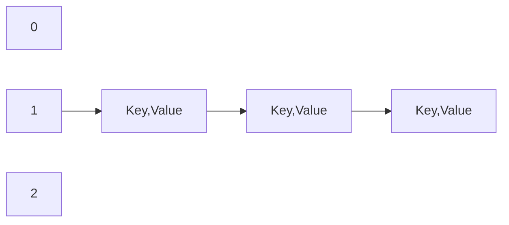

# HashMap

Hash table based implementation of the Map interface. This implementation provides all the optional map operations, and
permits null values and the null key.

Keeps values as Key-Value pair

## Constructors

**HashMap**  
&nbsp;&nbsp;&nbsp;&nbsp;&nbsp;&nbsp;Constructs an empty HashMap with the default initial capacity (16) and the default load factor (0.75).

**HashMap(int initialCapacity)**  
&nbsp;&nbsp;&nbsp;&nbsp;&nbsp;&nbsp;Constructs an empty HashMap with the specified initial capacity and the default load factor (0.75).

**HashMap(int initialCapacity, float loadFactor)**  
&nbsp;&nbsp;&nbsp;&nbsp;&nbsp;&nbsp;Constructs an empty HashMap with the specified initial capacity and load factor.

**HashMap(Map<? extends K,? extends V> m)**  
&nbsp;&nbsp;&nbsp;&nbsp;&nbsp;&nbsp;Constructs a new HashMap with the same mappings as the specified Map.

## Time complexity

| Scenario                    | Complexity |
|-----------------------------|------------|
| Best case (if key is known) | O(1)       |
| Worst case                  | O(n)       |

## How does it work?

To store a value we call `put(key, value)` function. When we call `put()`, it calls `hashCode()` function of the given
object to get its initial hash value. Next, the `hash()` function of the hash map is called internally to compute the
final hash value using the initial hash value. This final hash value ultimately boils down to an index in the internal
array or what we call a bucket location.

## Performance

The performance of a hash map is affected by two parameters: *Initial Capacity* and *Load Factor*. The capacity is the
number of buckets or the underlying array length and the initial capacity is simply the capacity during creation.

The load factor or *LF*, in short, is a measure of how full the hash map should be after adding some values before it is
resized.

The default initial capacity is 16 and default load factor is 0.75. We can create a hash map with custom values for
initial capacity and LF:

```
Map<String,String> hashMapWithCapacity=new HashMap<>(32);
Map<String,String> hashMapWithCapacityAndLF=new HashMap<>(32, 0.5f);
```

When the number of hash map entries exceeds the product of LF and capacity, then **rehashing** occurs i.e. **another
internal array is created with twice the size of the initial one and all entries are moved over to new bucket locations
in the new array.**

A **low initial capacity** reduces space cost but **increases the frequency of rehashing**. Rehashing is obviously a
very expensive process. So as a rule, if you anticipate many entries, you should set a considerably high initial
capacity.

On the flip side, if you set the initial capacity too high, you will pay the cost in iteration time.

So **a high initial capacity is good for a large number of entries coupled with little to no iteration.**

A **low initial capacity is good for few entries with a lot of iteration.**

## Collision

A collision, or more specifically, a hash code collision in a HashMap, is a situation where **two or more key objects
produce the same final hash value** and hence point to the same bucket location or array index.

This scenario can occur because according to the `equals()` and `hashCode()` contract, **two unequal objects in Java can have
the same hash code.**

It can also happen because of the finite size of the underlying array, that is, before resizing. The smaller this array,
the higher the chances of collision.

**Keep in mind that it's the hash value of the key that determines the bucket the object will be stored in. And so, if
the hash codes of any two keys collide, their entries will still be stored in the same bucket.** And by default, the
implementation uses a linked list as the bucket implementation.

The initially constant time O(1) put and get operations will occur in linear time O(n) in the case of a collision. This
is because after finding the bucket location with the final hash value, each of the keys at this location will be
compared with the provided key object using the equals API.



In the example above, we can see that there are 3 collisions for the objects that has `1` as `hash value`. From Java 8,
the linked lists are dynamically replaced with balanced binary search trees in collision resolution after the number of
collisions in a given bucket location exceed a certain threshold.

This change offers a performance boost, since, in the case of a collision, storage and retrieval happen in O(log n).

This section is very common in technical interviews, especially after the basic storage and retrieval questions.

## Collision Resolution Techniques

1) Open Addressing
    1) Linear probing
    2) Quadratic probing
    3) Double hashing technique

2) Closed Addressing
    1) Chaining
    
For more detail about collision resolution; [quescol.com - Collision in Hashing and Collision resolution technique](https://quescol.com/data-structure/collision-in-hashing-and-collision-resolution-technique)

Sources
- [oracle.com - HashMap](https://docs.oracle.com/javase/8/docs/api/java/util/HashMap.html)
- [baeldung.com - Java Hashmap Advanced](https://www.baeldung.com/java-hashmap-advanced)

